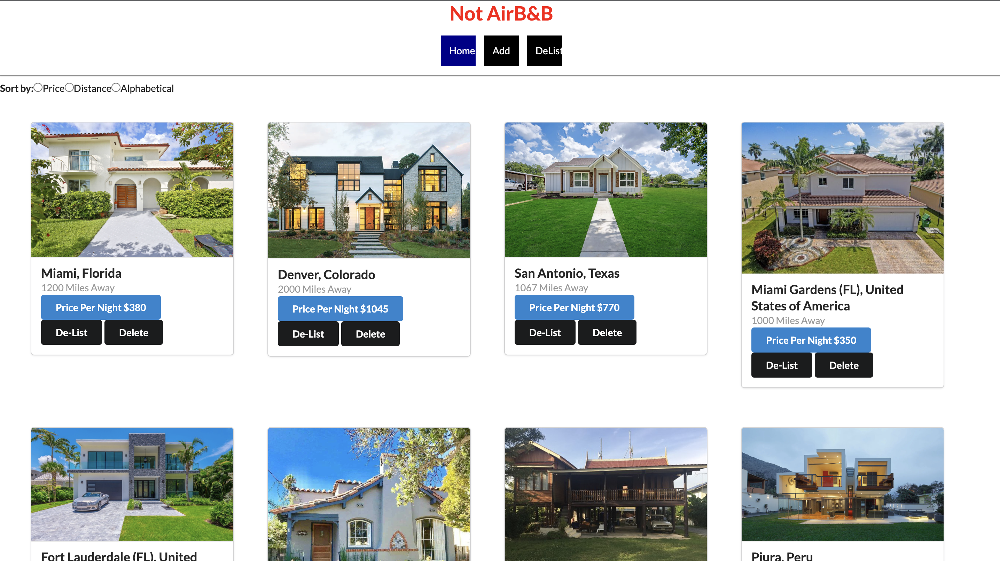

# Welcome to "Not Air B&B"!

### Have you ever heard of passive income? Ok great! Well one of the best ways for one to create wealth passively is to own realestate. One of the most popular forms of creating wealth through realestate is through AirB&B. In short AirB&B is basically car sharing (Uber, Lyft) but for homes. One can rent our their home for a weekend and make a few thousand dollars or so. 

#### I created an application similar to AirB&B which allows users to post their properties, set their price per night, and set distance just like the real AirB&B does. 

** Getting started **

#### To get started, clone, then type in "npm start" on one termina, then type "npm run server" on a second and tada, we can now see how our application looks.

