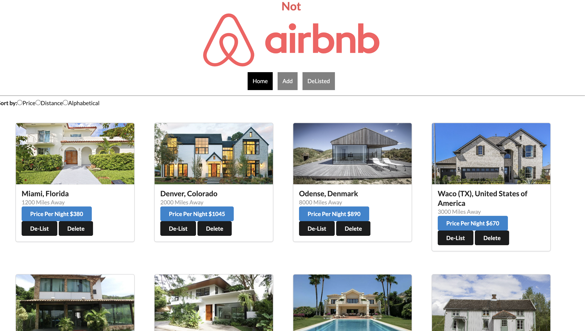
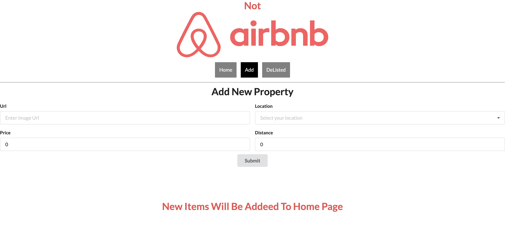
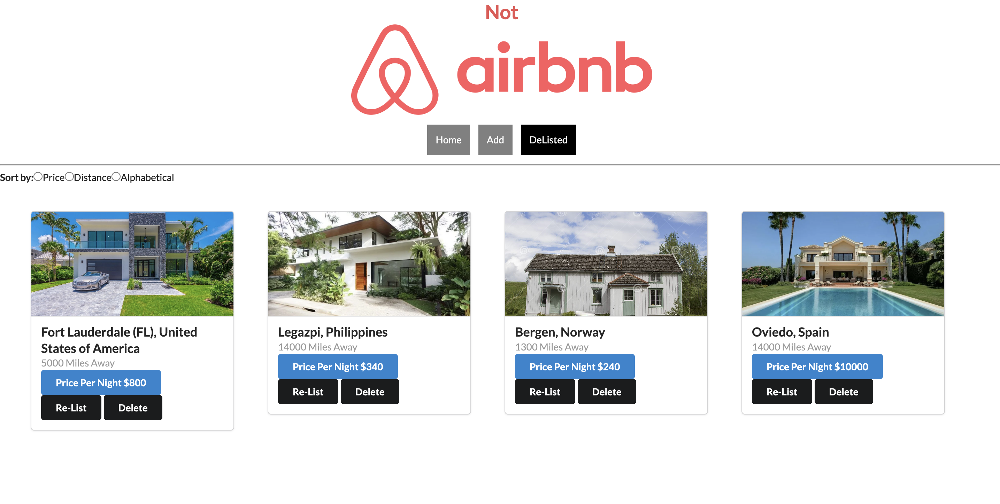

# Welcome to "Not Air B&B"!

## About:
   Have you ever heard of passive income? Ok great! Well one of the best ways for one to create wealth passively is to own realestate. One of the most popular forms of creating wealth through realestate is through AirB&B. In short AirB&B is basically car sharing (Uber, Lyft) but for homes. One can rent our their home for a weekend and make a few thousand dollars or so. 

#### I created an application similar to AirB&B which allows users to post their properties, set their price per night, and set distance just like the real AirB&B does. 

## How to start it up:
    Clone the repository and open it in your terminal. 
    Navigate to the react-phase-2-project folder and run:
   `$ npm install` or `$ npm i`
   
    Once your dependencies are installed, run:
   `$ npm run server` 

    Then in a new terminal, run:
   `$ npm start` 

    You will then be taken to the browser to start using the project.

## Home:

Here we have all of our listed properties along with our `Home`, `Add`, and `Delisted` buttons.

Home has all of our listed properties. Every individual property displays it's:

1: Location
2: Price per night
3: Distance

Each property also gives the user an option to either `De-list` it or `Delete` it. Delisting the property will send it to the `Delisted` page, Deleting the property will remove it from our application.

There's also an option to filter your properties by price, distance, and alphabetical.

## Add:

The `Add` page allows the user to add a new property to the Home page by inputing an image Url, selecting a loctaion, and then adding a price per night, and distance. Once that information is filled in, the user can now submit it to his Home page.

## Delisted:

The `Delisted` page are filled with properties that were delisted from our `Home` page. Each individual property displays it's, location, Price per night, and Miles away. Directly under that we have our `Delete` button along side our `Re-list` button, when clicked sends that individual property back to the `Home` page. 

### Details:
To upload a property image one will need to use links as such:
https://www.cedarhomes.com/home-plans/images/10020_header.png
https://www.laurau.com/wp-content/uploads/Blog-Headers-3.jpg

### source:
Location Dropdown `Add` page: https://countriesnow.space/api/v0.1/countries/population/cities
